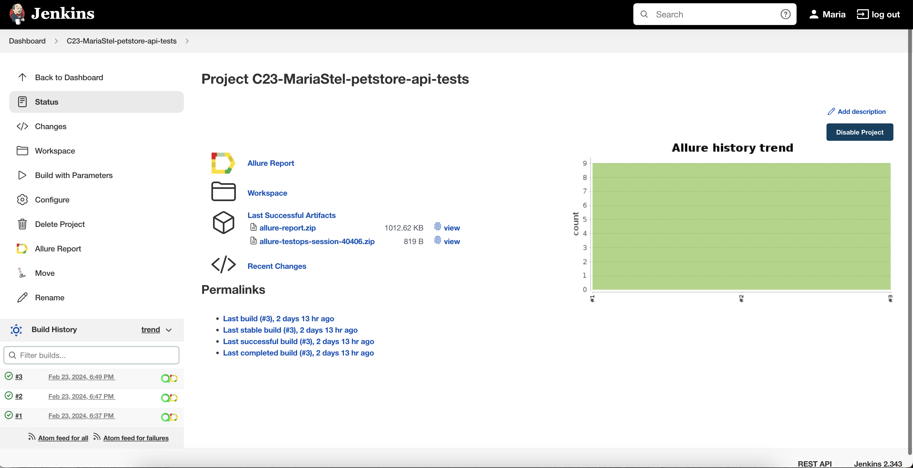
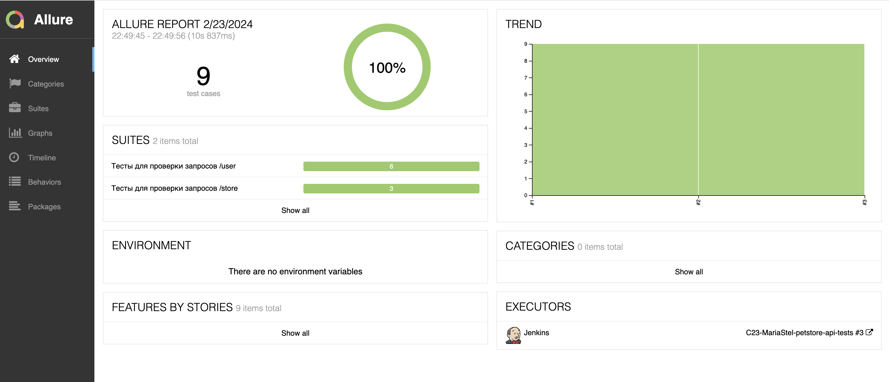
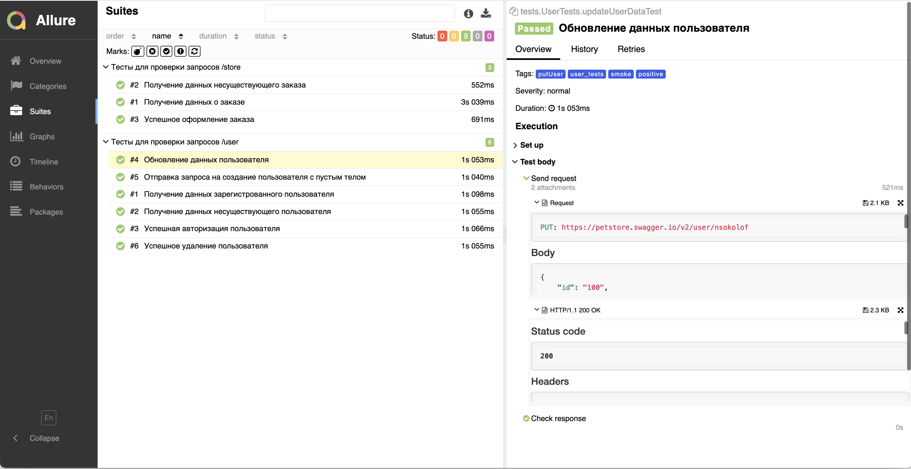
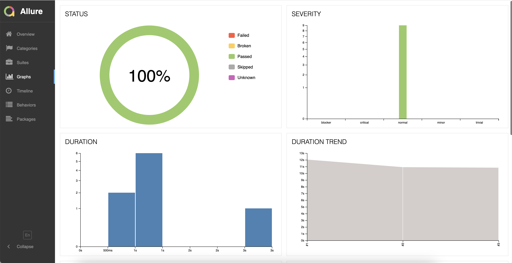
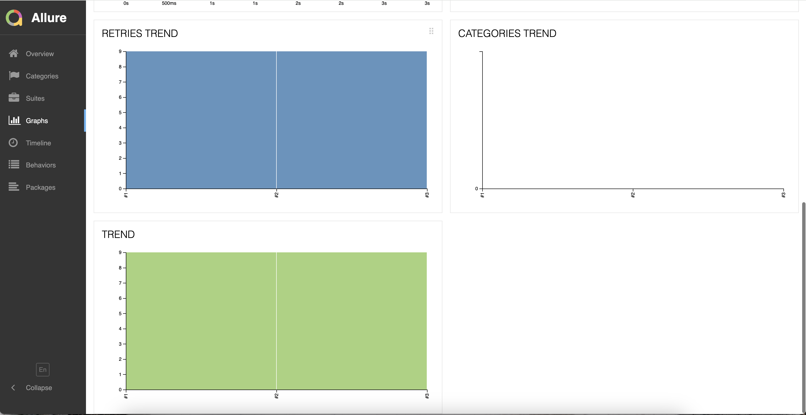
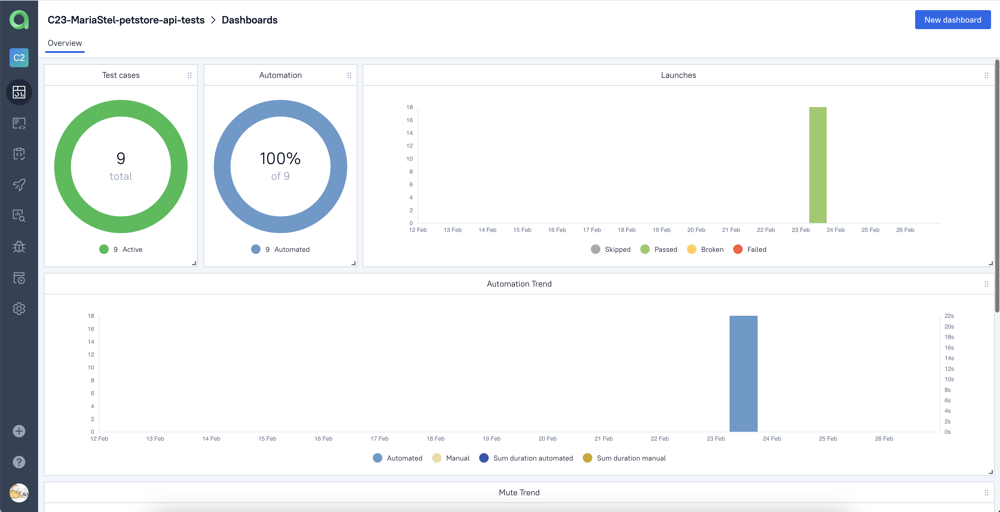
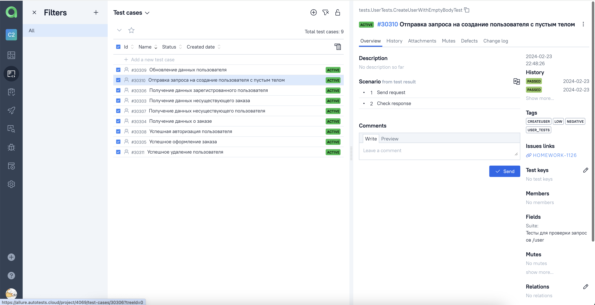
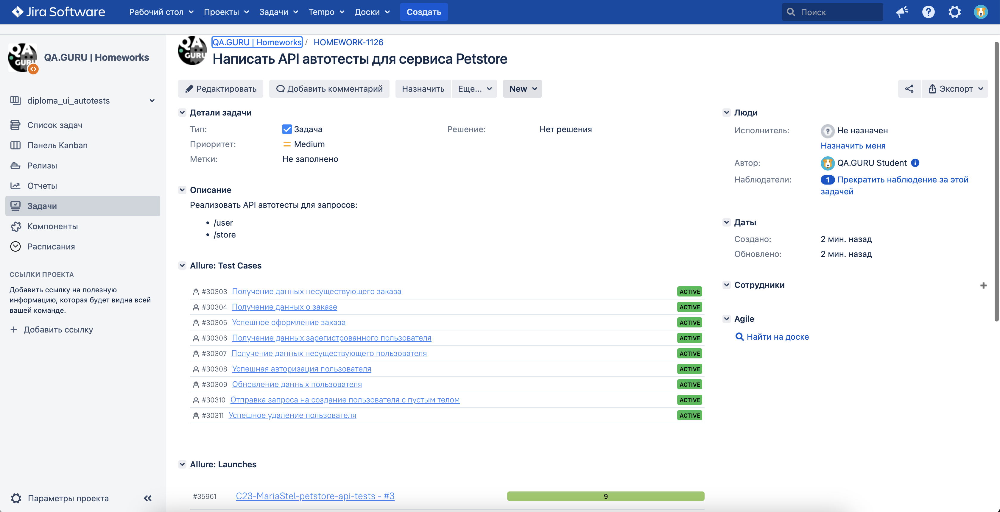
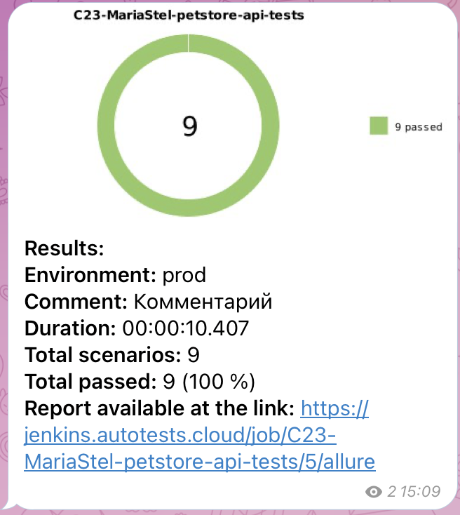

# Проект по автоматизации тестирования для сервиса [Petstore](https://petstore.swagger.io/)

> This is a sample server Petstore server.

## **Содержание:**
____

* <a href="#tools">Технологии и инструменты</a>

* <a href="#cases">Примеры автоматизированных тест-кейсов</a>

* <a href="#jenkins">Сборка в Jenkins</a>

* <a href="#console">Запуск из терминала</a>

* <a href="#allure">Allure отчет</a>

* <a href="#allure-testops">Интеграция с Allure TestOps</a>

* <a href="#jira">Интеграция с Jira</a>

* <a href="#telegram">Уведомление в Telegram при помощи бота</a>

____
<a id="tools"></a>
## <a name="Технологии и инструменты">**Технологии и инструменты:**</a>

<p align="center">  
<a href="https://www.jetbrains.com/idea/"></a>  
<a href="https://www.java.com/"></a>  
<a href="https://github.com/"></a>  
<a href="https://junit.org/junit5/"></a>  
<a href="https://gradle.org/"></a>  
<a href="https://selenide.org/"></a>  
<a href="https://aerokube.com/selenoid/"></a>  
<a href="ht[images](images)tps://github.com/allure-framework/allure2"></a> 
<a href="https://qameta.io/"></a>   
<a href="https://www.jenkins.io/"></a>  
<a href="https://www.atlassian.com/ru/software/jira/"></a>  
</p>

- Язык для написания тестов : [Java](https://www.java.com/ru/)
- Фреймворк для модульного тестирования : [Junit5](https://github.com/junit-team/junit5)
- Система автоматической сборки : [Gradle](https://github.com/gradle)
- Удаленный запуск с выбором параметров для тестов реализован при помощи :  [Jenkins](https://www.jenkins.io/)
- Отчеты о пройденных тестах формируются при помощи : [Allure](https://github.com/allure-framework)
- Так же отчеты о тестировании отправляются в мессенджер при помощи <code>Telegram</code> бота
- Реализована интеграция  с [Allure TestOps](https://qameta.io/)
- Реализована интеграция с [Jira Software](https://www.atlassian.com/software/jira)
- Реализация API тестов при помощи <code>RestAssured</code>

____
<a id="cases"></a>
## <a name="Примеры автоматизированных тест-кейсов">**Примеры автоматизированных тест-кейсов:**</a>
____
- ✓ *Получение данных зарегистрированного пользователя*
- ✓ *Обновление данных пользователя*
- ✓ *Успешная авторизация пользователя*
- ✓ *Успешное удаление пользователя*
- ✓ *Успешное оформление заказа*
- ✓ *Получение данных о заказе*


____
<a id="jenkins"></a>
## </a><a name="Сборка"></a>Сборка в [Jenkins](https://jenkins.autotests.cloud/job/C23-MariaStel-jenkins-unit17)</a>
____
<p align="center">  
<a href="https://jenkins.autotests.cloud/job/C23-MariaStel-petstore-api-tests/"></a>  
</p>


### **Параметры сборки в Jenkins:**

- *host (удаленный или локальный запуск, по умолчанию  remote)*
- *task (выбор группы тестов для запуска, по умолчанию все - test)*

<a id="console"></a>
## Команды для запуска из терминала
___
***Локальный запуск:***
```bash  
gradle clean test
```

***Удалённый запуск через Jenkins:***
```bash  
clean ${TASK} 
-Dhost=${HOST}
```
___
<a id="allure"></a>
## </a> <a name="Allure"></a>Allure [отчет](https://jenkins.autotests.cloud/job/C23-MariaStel-petstore-api-tests/3/allure/)</a>
___

### *Основная страница отчёта*

<p align="center">  
  
</p>  

### *Тест-кейсы*

<p align="center">  
  
</p>

### *Графики*

  <p align="center">  


  
</p>

___
<a id="allure-testops"></a>
## </a>Интеграция с <a target="_blank" href="https://allure.autotests.cloud/project/4069/dashboards">Allure TestOps</a>
____
### *Allure TestOps Dashboard*

<p align="center">  
  
</p>

### *Авто тест-кейсы*

<p align="center">  
  
</p>

___
<a id="jira"></a>
## </a> Интеграция с <a target="_blank" href="https://jira.autotests.cloud/browse/HOMEWORK-1126">Jira</a>
____
<p align="center">  
  
</p>

____
<a id="telegram"></a>
## </a> Уведомление в Telegram при помощи бота
____
<p align="center">  
  
</p>

